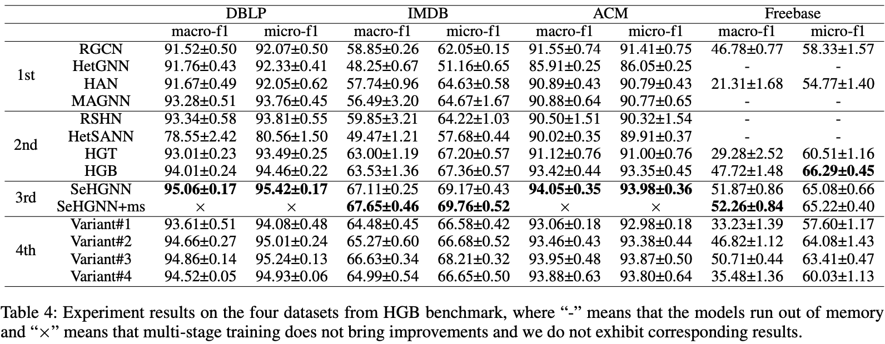

# SeHGNN on the four medium-scale datasets

## Training

To reproduce the results of SeHGNN on four medium-scale datasets, please run following commands.

For **DBLP**:

```bash
python main.py --stage 200 --dataset DBLP --act leaky-relu --n-layers-1 2 --n-layers-2 3 --num-hops 2 --num-label-hops 4 --label-feats --hidden 512 --embed-size 512 --residual --amp --seeds 1 2 3 4 5
```

For **ACM**:

```bash
python main.py --stage 200 --dataset ACM --act leaky-relu --n-layers-1 2 --n-layers-2 3 --num-hops 4 --num-label-hops 3 --label-feats --hidden 512 --embed-size 512 --amp --seeds 1 2 3 4 5
```

For **IMDB**:

```bash
python main.py --stage 200 --dataset IMDB --act leaky-relu --n-layers-1 2 --n-layers-2 4 --num-hops 4 --num-label-hops 4 --label-feats --hidden 512 --embed-size 512 --amp --seeds 1 2 3 4 5
```

For **Freebase**:

```bash
python main.py --stage 200 --dataset Freebase --act leaky-relu --n-layers-1 2 --n-layers-2 4 --num-hops 2 --num-label-hops 3 --label-feats --hidden 512 --embed-size 512 --residual --lr 3e-4 --weight-decay 1e-4 --batch-size 256 --bns --amp --seeds 1 2 3 4 5
```

## Ablation experiments

**Variant#1**: adding GAT-based attenion for neighbor aggregation:

```bash
python main.py --stage 200 --dataset DBLP --act leaky-relu --n-layers-1 2 --n-layers-2 3 --num-hops 2 --num-label-hops 4 --label-feats --hidden 512 --embed-size 512 --residual --amp --seeds 1 2 3 4 5 -na --num-heads 8

python main.py --stage 200 --dataset ACM --act leaky-relu --n-layers-1 2 --n-layers-2 3 --num-hops 4 --num-label-hops 3 --label-feats --hidden 512 --embed-size 512 --amp --seeds 1 2 3 4 5 -na --num-heads 8

python main.py --stage 200 --dataset IMDB --act leaky-relu --n-layers-1 2 --n-layers-2 4 --num-hops 4 --num-label-hops 4 --label-feats --hidden 512 --embed-size 512 --amp --seeds 1 2 3 4 5 -na --num-heads 8

python main.py --stage 200 --dataset Freebase --act leaky-relu --n-layers-1 2 --n-layers-2 4 --num-hops 2 --num-label-hops 3 --label-feats --hidden 512 --embed-size 512 --residual --lr 3e-4 --weight-decay 1e-4 --batch-size 256 --bns --amp --seeds 1 2 3 4 5 -na --num-heads 8
```

**Variant#2**: a two-layer SeHGNN where each layer has independent neighbor aggregation and semantic fusion steps

```bash
python main.py --stage 200 --dataset DBLP --act leaky-relu --n-layers-1 2 --n-layers-2 3 --num-hops 1 --num-label-hops 4 --label-feats --hidden 512 --embed-size 512 --residual --amp --seeds 1 2 3 4 5 --two-layer

python main.py --stage 200 --dataset ACM --act leaky-relu --n-layers-1 2 --n-layers-2 3 --num-hops 2 --num-label-hops 3 --label-feats --hidden 512 --embed-size 512 --amp --seeds 1 2 3 4 5 --two-layer

python main.py --stage 200 --dataset IMDB --act leaky-relu --n-layers-1 2 --n-layers-2 4 --num-hops 2 --num-label-hops 4 --label-feats --hidden 512 --embed-size 512 --amp --seeds 1 2 3 4 5 --two-layer

python main.py --stage 200 --dataset Freebase --act leaky-relu --n-layers-1 2 --n-layers-2 4 --num-hops 1 --num-label-hops 3 --label-feats --hidden 512 --embed-size 512 --residual --lr 3e-4 --weight-decay 1e-4 --batch-size 256 --bns --amp --seeds 1 2 3 4 5 --two-layer
```

**Variant#3**: removing label propagation

```bash
python main.py --stage 200 --dataset DBLP --act leaky-relu --n-layers-1 2 --n-layers-2 3 --num-hops 2 --hidden 512 --embed-size 512 --residual --amp --seeds 1 2 3 4 5

python main.py --stage 200 --dataset ACM --act leaky-relu --n-layers-1 2 --n-layers-2 3 --num-hops 4 --hidden 512 --embed-size 512 --amp --seeds 1 2 3 4 5

python main.py --stage 200 --dataset IMDB --act leaky-relu --n-layers-1 2 --n-layers-2 4 --num-hops 4 --hidden 512 --embed-size 512 --amp --seeds 1 2 3 4 5

python main.py --stage 200 --dataset Freebase --act leaky-relu --n-layers-1 2 --n-layers-2 4 --num-hops 2 --hidden 512 --embed-size 512 --residual --lr 3e-4 --weight-decay 1e-4 --batch-size 256 --bns --amp --seeds 1 2 3 4 5
```

**Variant#4**: replacing the transform-based fusion module with a weighted-sum one

```bash
python main.py --stage 200 --dataset DBLP --act leaky-relu --n-layers-1 2 --n-layers-2 3 --num-hops 2 --num-label-hops 4 --label-feats --hidden 512 --embed-size 512 --residual --amp --seeds 1 2 3 4 5 --remove-transformer

python main.py --stage 200 --dataset ACM --act leaky-relu --n-layers-1 2 --n-layers-2 3 --num-hops 4 --num-label-hops 3 --label-feats --hidden 512 --embed-size 512 --amp --seeds 1 2 3 4 5 --remove-transformer

python main.py --stage 200 --dataset IMDB --act leaky-relu --n-layers-1 2 --n-layers-2 4 --num-hops 4 --num-label-hops 4 --label-feats --hidden 512 --embed-size 512 --amp --seeds 1 2 3 4 5 --remove-transformer

python main.py --stage 200 --dataset Freebase --act leaky-relu --n-layers-1 2 --n-layers-2 4 --num-hops 2 --num-label-hops 3 --label-feats --hidden 512 --embed-size 512 --residual --lr 3e-4 --weight-decay 1e-4 --batch-size 256 --bns --amp --seeds 1 2 3 4 5 --remove-transformer
```

Please note that the HGB benckmark only makes public 50% labels of the test set. So the offline evaluation results have slight differences from the presented results in the paper. To evaluate all results of these datasets, please submit the result files to the [online evaluation website](https://www.biendata.xyz/competition/hgb-1/) of HGB benchmark.

Please also note that we have removed multi-stage training (abbreviated as *emb*) for medium-scale datasets in our paper and codes according to
reviewer's suggestions, as readers may misunderstand that the multi-stage training is one of main contributions of SeHGNN.

## Performance


