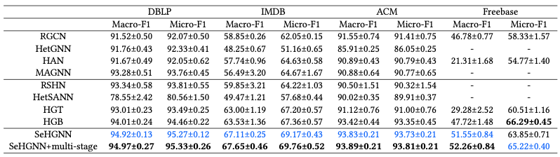

# SeHGNN on the four middle-scale datasets

## Training

To reproduce the results of SeHGNN on the four middle-scale datasets, please run following commands.

For **DBLP**:

```bash
python main.py --stages 200 200 200 200 --dataset DBLP --act leaky-relu --n-layers-1 4 --n-layers-2 3 --num-hops 2 --num-label-hops 4 --label-feats --moving-k 10 --hidden 512 --gama 10 --residual --threshold 0.7 --embed-size 512 --embed-train --amp
```

For **ACM**:

```bash
python main.py --stages 200 200 200 200 --dataset ACM --act leaky-relu --n-layers-1 4 --n-layers-2 3 --num-hops 4 --num-label-hops 3 --label-feats --moving-k 10 --hidden 512 --gama 10 --residual --threshold 0.735 --embed-size 512 --embed-train --amp
```

For **IMDB**:

```bash
python main.py --stages 200 200 200 200 --dataset IMDB --act leaky-relu --n-layers-1 4 --n-layers-2 4 --num-hops 3 --num-label-hops 4 --label-feats --moving-k 10 --hidden 512 --gama 10 --residual --threshold 0.1 --embed-size 512 --embed-train --amp
```

For **Freebase**:

```bash
python main.py --stages 200 200 200 200 --dataset Freebase --act leaky-relu --bns --n-layers-1 4 --n-layers-2 4 --lr 3e-4 --weight-decay 1e-4 --batch-size 1024 --num-hops 2 --num-label-hops 3 --label-feats --moving-k 10 --store-model --hidden 512 --gama 10 --threshold 0.4 --embed-size 512 --embed-train --amp
```

Please note that the test labels of IMDB and Freebase are not made public by HGB benchmark. We set the test accuracy to 0 during training.

To evaluate results of these two datasets, please submit the result files to the website of HGB benchmark.

## Performance

We rank 1st at the node classification tasks of the HGB benchmark since March 2022.


