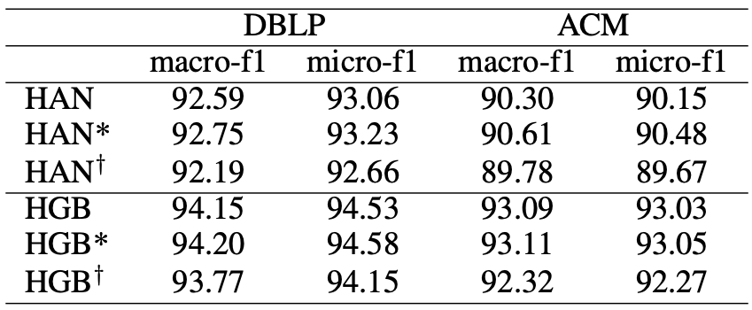

# HAN code

Adapted from [HGB benchmark](https://github.com/THUDM/HGB/tree/master/NC/HAN).


## Running Procedure

For the results of original HAN, run

```bash
python main.py --dataset DBLP --use-gat --seeds 1 2 3 4 5
```

```bash
python main.py --dataset ACM_HGB --use-gat --lr 0.001 --seeds 1 2 3 4 5
```

We implement a novel graph convolutional layer named MeanAggregator to replace the GAT layer in the neighbor aggregation step on HAN. The MeanAggregator is based on the implementation of the GCN layer in the DGL library, but we add a dropout layer for feature vectors and a dropout layer for edges to keep consistent with the GAT layer.

For the results of our MeanAggregator (i.e. ${\rm HAN}^*$) which removes neighbor attention, run

```bash
python main.py --dataset DBLP --seeds 1 2 3 4 5
```

```bash
python main.py --dataset ACM_HGB --lr 0.001 --seeds 1 2 3 4 5
```

For the results ${\rm HAN}^\dagger$ which removes semantic attention, run

```bash
python main.py --dataset DBLP --use-gat --remove-sa-attn --seeds 1 2 3 4 5
```

```bash
python main.py --dataset ACM_HGB --use-gat --remove-sa-attn --lr 0.001 --seeds 1 2 3 4 5
```

## Performance

