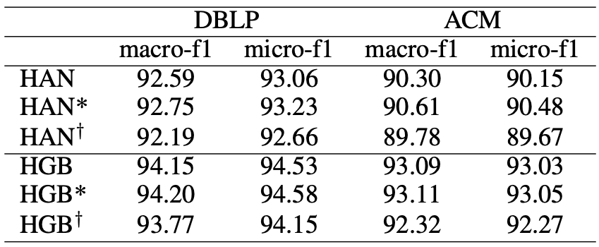

# HGB code

Adapted from [HGB benchmark](https://github.com/THUDM/HGB/tree/master/NC/benchmark/methods/baseline).

## Running Procedure

For the results of original HGB, run

```bash
python run_new.py --dataset DBLP --seeds 1 2 3 4 5
```

```bash
python run_new.py --dataset ACM --feats-type 2 --lr 0.001 --seeds 1 2 3 4 5
```

To eliminate the influence of neighbor attention, ${\rm HGB}^*$ adds additional functions after attention calculation to average the weights of neighbors with the same node type. Similar methods are used to eliminate the influence of semantic attention, and the results are represented as ${\rm {HGB}^\dagger}$.

For the results of our MeanAggregator (i.e. ${\rm HGB}^*$) which removes neighbor attention, run

```bash
python run_new.py --dataset DBLP --average-attention-values --seeds 1 2 3 4 5
```

```bash
python run_new.py --dataset ACM --feats-type 2 --average-attention-values --lr 0.001 --seeds 1 2 3 4 5
```

For the results ${\rm HAN}^\dagger$ which removes semantic attention, run

```bash
python run_new.py --dataset DBLP --average-semantic-values --seeds 1 2 3 4 5
```

```bash
python run_new.py --dataset ACM --feats-type 2 --average-semantic-values --lr 0.001 --seeds 1 2 3 4 5
```

## Performance

