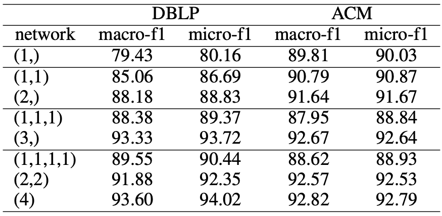

# HAN code

Adapted from [HGB benchmark](https://github.com/THUDM/HGB/tree/master/NC/HAN).

## Extra Data Preparation

* Download ACM.mat from [the source of HGB benchmark](https://cloud.tsinghua.edu.cn/d/0e784c52a6084b59bdee/files/?p=%2FDGL%E4%BB%A3%E7%A0%81%E7%89%88%E6%9C%AC%2FACM.mat)
* Move ACM.mat to the directory `../../data/`

## Running Procedure

We test different network structure on HAN. For example, the structure (1,1,1) means a three-layer network with metapaths no more than 1 hop in each layer.

We test several combinations of metapaths and present the best result for each structure. All the combinations are collected in files `run_dblp.sh` and `run_acm.sh`.

If you just want to reproduce the results presented in the paper, run

```bash
# (1)
python main.py --metapaths a p c ap pa tp pt cp pc --num-heads 8 --seeds 1 2 3 4 5 > 1__01.txt &!
python main.py --dataset ACM --metapaths a p f ap pa pf fp --num-heads 8 --seeds 1 2 3 4 5 > ACM_1__01.txt &!

# (1,1)
python main.py --metapaths ap pa tp pt cp pc --num-heads 8 8 --seeds 1 2 3 4 5 > 1_1__1.txt &!
python main.py --dataset ACM --metapaths p ap pa pf fp --num-heads 8 8 --seeds 1 2 3 4 5 > ACM_1_1__t1.txt &!

# (2)
python main.py --metapaths apa apc apt --num-heads 8 --seeds 1 2 3 4 5 > 2__2.txt &!
python main.py --dataset ACM --metapaths pa pf pap pfp --num-heads 8 --seeds 1 2 3 4 5 > ACM_2__12.txt &!

# (1,1,1)
python main.py --metapaths ap pa tp pt cp pc --num-heads 8 8 8 --seeds 1 2 3 4 5 > 1_1_1__1.txt &!
python main.py --dataset ACM --metapaths a p f ap pa pf fp --num-heads 8 8 8 --seeds 1 2 3 4 5 > ACM_1_1_1__01.txt &!

# (3)
python main.py --metapaths a ap apa apc apt aptp apcp --num-heads 8 --seeds 1 2 3 4 5 > 3__0123.txt &!
python main.py --dataset ACM --metapaths pap pfp papa papf pfpa pfpf --num-heads 8 --seeds 1 2 3 4 5 > ACM_3__23.txt &!

# (1,1,1,1)
python main.py --metapath ap pa tp pt cp pc --num-heads 8 8 8 8 --seeds 1 2 3 4 5 > 1_1_1_1__1.txt &!
python main.py --dataset ACM --metapaths a p f ap pa pf fp --num-heads 8 8 8 8 --seeds 1 2 3 4 5 > ACM_1_1_1_1__01.txt &!

# (2,2)
python main.py --metapaths apa apc cpa apt tpa --num-heads 8 8 --seeds 1 2 3 4 5 > 2_2__2.txt &!
python main.py --dataset ACM --metapaths p pap pfp --num-heads 8 8 --seeds 1 2 3 4 5 > ACM_2_2__02.txt &!

# (4)
python main.py --metapaths a ap apa apc apt aptp apcp aptpa apcpa apapa --num-heads 8 --seeds 1 2 3 4 5 > 4__01234.txt &!
python main.py --dataset ACM --metapaths pap pfp papa papf pfpa pfpf papap papfp pfpap pfpfp --num-heads 8 --seeds 1 2 3 4 5 > ACM_4__234.txt &!
```

## Performance

