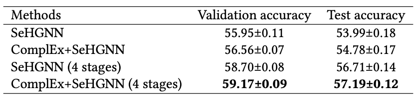

# SeHGNN on Ogbn-mag

For environment setup, please refer to the [main page](../Readme.md) of this repository.

## Training without extra embeddings

```setup
python main.py --stages 300 300 300 300 --num-hops 2 --label-feats --num-label-hops 2 \
	--n-layers-1 2 --n-layers-2 2 --residual --act leaky_relu --bns --label-bns \
	--lr 0.001 --weight-decay 0 --threshold 0.75 --patience 100 --gama 10 --amp --seeds 1
```

For the first time this command is executed, the dataset ogbn-mag will be automatically downloaded in the folder `../data/`.

The codes generate random initialized embeddings for node types author/topic/institution.

## Training with extra embeddings from ComplEx

For better model effects, we utilize [ComplEx](https://proceedings.mlr.press/v48/trouillon16.html) to generate embeddings for those three node types with no raw features.

Following [NARS](https://github.com/facebookresearch/NARS), we use `dglke` to generate embeddings. However, dglke only supports dgl<=0.4.3. We modify some files so that it fits the latest versions of dgl.

**1.Generate extra embeddings from ComplEx (from [NARS](https://github.com/facebookresearch/NARS/tree/main/graph_embed))**

**Warning: it requires `dgl<1.0` to run codes under `../data/complex_nars`.** It is sad that the `dglke` library has been discontinued and it only supports `dgl<1.0`.

Please make sure that the ogbn-mag dataset has been downloaded in the folder `../data/`.

Then under the folder `../data/complex_nars`, run

```setup
python convert_to_triplets.py --dataset mag

python embed_train.py --model ComplEx --batch_size 1000 --neg_sample_size 200 \
    --hidden_dim 256 --gamma 10 --lr 0.1 --max_step 500000 --log_interval 10000 \
    -adv --gpu 0 --regularization_coef 2e-6 --data_path . --data_files ./train_triplets_mag \
    --format raw_udd_hrt --dataset mag
```

Check the running log to find where the generated ComplEx features are saved. For example, if the save folder is `ckpts/ComplEx_mag_0`, run

```setup
python split_node_emb.py --dataset mag --emb-file ckpts/ComplEx_mag_0/mag_ComplEx_entity.npy
```

**2.Training our SeHGNN model**

Under this folder, run

```setup
python main.py --stages 300 300 300 300 --extra-embedding complex --num-hops 2 --label-feats --num-label-hops 2 \
	--n-layers-1 2 --n-layers-2 2 --residual --act leaky_relu --bns --label-bns \
	--lr 0.001 --weight-decay 0 --threshold 0.75 --patience 100 --gama 10 --amp --seeds 1
```

## Performance

