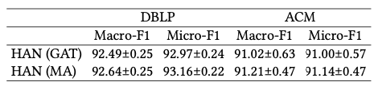
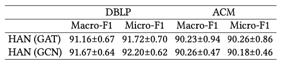

# HAN code

Adapted from [HGB benchmark](https://github.com/THUDM/HGB/tree/master/NC/HAN).

## Extra Data Preparation

* Download ACM.mat from [the source of HGB benchmark](https://cloud.tsinghua.edu.cn/d/0e784c52a6084b59bdee/files/?p=%2FDGL%E4%BB%A3%E7%A0%81%E7%89%88%E6%9C%AC%2FACM.mat)
* Move ACM.mat to the directory `../../data/`

## Running Procedure

For the results of original HAN in HGB benchmark, run

```bash
python main.py --dataset DBLP --use-gat
```

```bash
python main.py --dataset ACM --use-gat
```

We implement a novel graph convolutional layer named MeanAggregator (MA) to replace the GAT layer in the neighbor aggregation step on HAN. The MeanAggregator is based on the implementation of the GCN layer in the DGL library, but we add a dropout layer for feature vectors and a dropout layer for edges to keep consistent with the GAT layer. For the results of our MeanAggregator, run

```bash
python main.py --dataset DBLP
```

```bash
python main.py --dataset ACM
```

Performance on HAN with dropout ratio 0.6:



When the dropout ratios are set to 0, our MeanAggregator is equivalent to GCN. For the results of GCN and GAT without dropout layers, run

```bash
python main.py --dataset DBLP --dropout 0 --attn-dropout 0
```

```bash
python main.py --dataset ACM --dropout 0 --attn-dropout 0
```

```bash
python main.py --dataset DBLP --use-gat --dropout 0 --attn-dropout 0
```

```bash
python main.py --dataset ACM --use-gat --dropout 0 --attn-dropout 0
```

Performance on HAN with dropout ratio 0:


