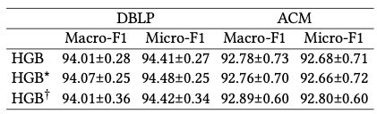

# HGB code

Adapted from [HGB benchmark](https://github.com/THUDM/HGB/tree/master/NC/benchmark/methods/baseline).

## Running Procedure

The experiments on HGB are carried out in three steps.

a) We train the original HGB model. The result is shown as ${\rm {HGB}}$.

b) We keep the model parameters of HGB unchanged and add additional functions after the calculation of the attention mechanism to average attention values of the same type of relations for each target node. The result is shown as ${\rm {HGB}^*}$.

c) We apply the modifications above and then re-train the model. The result is shown as ${\rm {HGB}^\dagger}$.

For the first two steps (${\rm {HGB}}$ and ${\rm {HGB}^*}$), run

```bash
python run_new.py --dataset DBLP
```

```bash
python run_new.py --dataset ACM --feats-type 2
```

For the last step (${\rm {HGB}^\dagger}$), run

```bash
python run_new.py --dataset DBLP --average-attention-values
```

```bash
python run_new.py --dataset ACM --feats-type 2 --average-attention-values
```

## Performance

